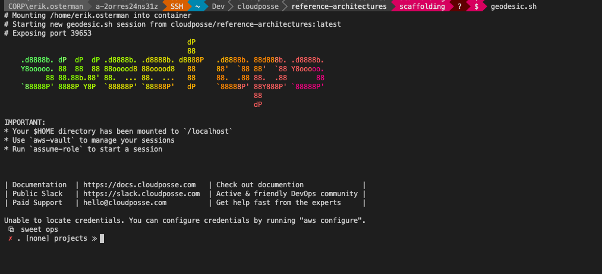

<!-- 


  ** DO NOT EDIT THIS FILE
  ** 
  ** This file was automatically generated by the `build-harness`. 
  ** 1) Make all changes to `README.yaml` 
  ** 2) Run `make init` (you only need to do this once)
  ** 3) Run`make readme` to rebuild this file. 
  **
  ** (We maintain HUNDREDS of open source projects. This is how we maintain our sanity.)
  **


  -->
[![README Header][readme_header_img]][readme_header_link]

[![Cloud Posse][logo]](https://cpco.io/homepage)

# Cloud Posse Reference Architectures

 [](https://github.com/cloudposse/reference-architectures/releases/latest) [](https://slack.cloudposse.com) [](https://ask.sweetops.com/)


Get up and running quickly with one of our reference architectures using our fully automated cold-start process.

**NOTE:** This project is under active development and subject to change. Please [file issues](https://github.com/cloudposse/reference-architectures/issues/new) for all bugs encountered.

## Table of Contents
- [Reference Architectures](#reference-architectures)
  - [Table of Contents](#table-of-contents)
  - [Known Limitations](#known-limitations)
  - [High-Level Overview](#high-level-overview)
    - [Architecture](#architecture)
    - [Assumptions](#assumptions)
    - [Checklist](#checklist)
  - [Get Started](#get-started)
    - [1. Provision Master Account](#1-provision-master-account)
    - [2. Provision Member Accounts](#2-provision-member-accounts)
    - [3. Delegate DNS](#3-delegate-dns)
  - [Next Steps](#next-steps)
  - [Getting Help](#getting-help)


---

This project is part of our comprehensive ["SweetOps"](https://cpco.io/sweetops) approach towards DevOps. 
[][share_email]
[][share_googleplus]
[][share_facebook]
[][share_reddit]
[][share_linkedin]
[][share_twitter]


It's 100% Open Source and licensed under the [APACHE2](LICENSE).


## Screenshots



*Example of using the `geodesic` shell as a build a docker image built from the `cloudposse/reference-architectures`*


## Introduction

## High-Level Overview

You can provision the basic reference architecture in 3 "easy" steps. =)

All accounts will leverage our [`terraform-root-modules`](https://github.com/cloudposse/terraform-root-modules/) service catalog to get you started. Later, we recommend you fork this and start your very own service catalog suitable for your organization.

This process involves using `terraform` to generate the code (`Dockerfile`, `Makefile`, `terraform.tfvar`, etc) that you will use to manage your infrastructure.

This repo contains everything necessary to administer this architecture. We strive for a "share nothing" approach, which is why we use multiple AWS accounts and DNS zones. This reduces the blast radius from human errors. This reference architecture is _ideally_ suited for larger enterprise or corporate environments where various stakeholders will be responsible for running services in their account.

See the [Next Steps](#next-steps) section for where to go after this process completes.

### Architecture

Our "reference architecture" is an opinionated approach to architecting accounts for AWS.

This process provisions 7+ accounts that have different designations.

Here is what it includes. Enable the accounts you want.

| Account  | Description                                                                                  |
|----------|----------------------------------------------------------------------------------------------|
| master   | The "master" (parent, billing) account creates all member accounts and is where users login. |
| prod     | The "production" is account where you run your most mission critical applications            |
| staging  | The "staging" account is where you run all of your QA/UAT/Testing                            |
| dev      | The "dev" sandbox account is where you let your developers have fun and break things         |
| audit    | The "audit" account is where all logs end up                                                 |
| corp     | The "corp" account is where you run the shared platform services for the company             |
| data     | The "data" account is where the quants live =)                                               |
| testing  | The "testing" account is where to run automated tests of unblessed infrastructure code       |
| security | The "security" account is where to run automated security scanning software                  |
| identity | The "identity" account is where to add users and delegate access to the other accounts       |

Each account has its own [terraform state backend](https://github.com/cloudposse/terraform-aws-tfstate-backend), along with a [dedicated DNS zone](https://www.terraform.io/docs/providers/aws/r/route53_zone.html) for service discovery.

The master account owns the top-level DNS zone and then delegates NS authority to each member account.


## Quick Start


### Assumptions

1. We are starting with a clean AWS environment and a new "master" (top-level) AWS account. This means you need the "master" credentials, since a fresh AWS account doesn't even have any AWS roles that can be assumed.
2. You have administrator access to this account.
3. You have [docker](https://docs.cloudposse.com/tools/docker/) installed on your workstation.
4. You have [terraform](https://www.terraform.io/downloads.html) installed on your workstation.

### Checklist

Before we get started, make sure you have the following

- [ ] Before you can create new AWS accounts under your organization, you must [verify your email address](https://docs.aws.amazon.com/console/organizations/email-verification).
- [ ] Open a support ticket to [request the limit](https://console.aws.amazon.com/support/v1#/case/create) of AWS accounts be increased for your organization (the default is 1).
- [ ] Clone this repo on your workstation.
- [ ] Create a _temporary_ pair of [Access Keys](https://console.aws.amazon.com/iam/home#/security_credential). These should be deleted afterwards.
- [ ] Export your AWS "root" account credentials as `AWS_ACCESS_KEY_ID` and `AWS_SECRET_ACCESS_KEY` (this is _temporary_ for bootstrapping).
- [ ] An available domain we can use for DNS-base service discovery (E.g. `ourcompany.co`). This domain must not be in use elsewhere as the master account will need to be the authoritative name server (`SOA`).

## Getting Started

### 1. Provision Master Account

The "master" account is the top-most AWS account from which all other AWS accounts are programmatically created.

**WARNING:** Terraform cannot remove an AWS account from an organization. Terraform **cannot** close the account. The member account must be prepared to be a standalone account beforehand. To do this, issue a password reset using the member account's email address. Login and accept the prompts. Then you should be good to go. See the [AWS Organization documentation](https://docs.aws.amazon.com/organizations/latest/userguide/orgs_manage_accounts_remove.html) for more information.

This account is provisioned slightly differently from the other member accounts.

Update the configuration for this account by editing the `configs/master.tfvar` file.

Then to get started, run:

```bash
make root
```

**NOTE:** We need to know each account's `AWS_ACCOUNT_ID` for Step 2.
**NOTE:** Sometimes provisioning of the `account` module fails due to rate limiting by AWS on creating member accounts. If this happens, just run `make root/provision` to retry. If that works, just continue on with step 2, once it completes.

<details>
  <summary>Here's what that roughly looks like (but entirely automated). </summary>

1. Create a new account git repo.
2. Render templates into the repo (including `Dockerfile`).
3. Build a docker image.
4. Run the docker image and start provisioning resources including the Terraform state backend and member accounts.
5. Create the IAM groups to permit access to member accounts.
6. Write a list of member account IDs so we can use them in the next phase.

</details>

### 2. Provision Member Accounts

Member accounts are created from the master account.

Update the configuration for all the member accounts by editing the `configs/$env.tfvar` file (replace `$env` with the name of the account).

To get started, run:

```bash
make children
```

<details>

<summary>Here's what that roughly looks like (but entirely automated).</summary>

For each member account:

1. Create a new account git repo.
2. Render the templates for a `member` account into the repo directory (include `Dockerfile`). Obtain the account ID from the previous phase.
3. Build a docker image.
4. Run the docker image and start provisioning the member account's Terraform state bucket, DNS zone, cloudtrail logs, etc.

</details>

### 3. Delegate DNS

Now that each member account has been provisioned, we can delegate each DNS zone to those accounts.

To finish up, run:

```bash
make finalize
```

<details>
<summary>Here's what that roughly looks like (but entirely automated).</summary>

1. Re-use the docker images from phase (1) and phase (2).
2. Update DNS so that `master` account delegates DNS zones to the member accounts.
3. Enable cloudtrail log forwarding to `audit` account.

</details>

---

## Known Limitations

- **AWS does not support programmatic deletion of accounts.** This means that if you use this project to create the account structure, but terraform is not able to completely tear it down. Deleting AWS accounts is a long, painful process, because AWS does not want to be on the hook for deleting stuff that it cannot get back. 
- **AWS by default only permits one member account.** This limit can be easily increased for your organization by contacting AWS support, but it can take up to several days.
- **AWS will rate limit account creation.** This might mean you'll need to restart the provisioning.
- **AWS only supports creating member accounts from the master account.** This means you cannot create accounts from within member accounts. 
- **AWS does not permit email addresses to be reused across accounts.** One key thing is that the email address associated with the account will be forever associated with that account. You will not be able to create a new account with that email address and you will not be able to change the email address later. So before you delete an account, change the email address to something you can consider a throwaway. Gmail and some other providers allow you to use plus-addressing (e.g. `aws+anything@ourcompany.com`)" to your username to create a unique email that still routes to you, so we suggest you use plus addressing for your accounts.

## Next Steps

At this point, you have everything you need to start terraforming your way to success.

All of your account configurations are currently in `repos/`

- [ ] Commit all the changes made. Open Pull Requests.
- [ ] Ensure that the name servers for the service discovery domain (e.g. `ourcompany.co`) have been configured with your domain registrar (e.g. GoDaddy).
- [ ] Delete your master account credentials. They are no longer needed and should not be used. Instead, use the created IAM users.
- [ ] Request limits for EC2 instances to be raised in each account corresponding to the region you will be operating in.
- [ ] Set the member account's credentials. To do this, issue a password reset using the member account's email address. Login and accept the prompts. Setup MFA.
- [ ] Ensure you have MFA setup on your master account.
- [ ] Consider adding some other capabilities from our service catalog.
- [ ] Create your own [`terraform-root-modules`](https://github.com/cloudposse/terraform-root-modules) service catalog for your organization.

## Getting Help

Did you get stuck? Find us on [slack](https://sweetops.cloudposse.com) in the `#geodesic` channel.


## Help

**Got a question?** We got answers. 

File a GitHub [issue](https://github.com/cloudposse/reference-architectures/issues), send us an [email][email] or join our [Slack Community][slack].

[![README Commercial Support][readme_commercial_support_img]][readme_commercial_support_link]

## DevOps Accelerator for Startups


We are a [**DevOps Accelerator**][commercial_support]. We'll help you build your cloud infrastructure from the ground up so you can own it. Then we'll show you how to operate it and stick around for as long as you need us. 

[][commercial_support]

Work directly with our team of DevOps experts via email, slack, and video conferencing.

We deliver 10x the value for a fraction of the cost of a full-time engineer. Our track record is not even funny. If you want things done right and you need it done FAST, then we're your best bet.

- **Reference Architecture.** You'll get everything you need from the ground up built using 100% infrastructure as code.
- **Release Engineering.** You'll have end-to-end CI/CD with unlimited staging environments.
- **Site Reliability Engineering.** You'll have total visibility into your apps and microservices.
- **Security Baseline.** You'll have built-in governance with accountability and audit logs for all changes.
- **GitOps.** You'll be able to operate your infrastructure via Pull Requests.
- **Training.** You'll receive hands-on training so your team can operate what we build.
- **Questions.** You'll have a direct line of communication between our teams via a Shared Slack channel.
- **Troubleshooting.** You'll get help to triage when things aren't working.
- **Code Reviews.** You'll receive constructive feedback on Pull Requests.
- **Bug Fixes.** We'll rapidly work with you to fix any bugs in our projects.

## Slack Community

Join our [Open Source Community][slack] on Slack. It's **FREE** for everyone! Our "SweetOps" community is where you get to talk with others who share a similar vision for how to rollout and manage infrastructure. This is the best place to talk shop, ask questions, solicit feedback, and work together as a community to build totally *sweet* infrastructure.

## Discourse Forums

Participate in our [Discourse Forums][discourse]. Here you'll find answers to commonly asked questions. Most questions will be related to the enormous number of projects we support on our GitHub. Come here to collaborate on answers, find solutions, and get ideas about the products and services we value. It only takes a minute to get started! Just sign in with SSO using your GitHub account.

## Newsletter

Sign up for [our newsletter][newsletter] that covers everything on our technology radar.  Receive updates on what we're up to on GitHub as well as awesome new projects we discover. 

## Office Hours

[Join us every Wednesday via Zoom][office_hours] for our weekly "Lunch & Learn" sessions. It's **FREE** for everyone! 

[][office_hours]

## Contributing

### Bug Reports & Feature Requests

Please use the [issue tracker](https://github.com/cloudposse/reference-architectures/issues) to report any bugs or file feature requests.

### Developing

If you are interested in being a contributor and want to get involved in developing this project or [help out](https://cpco.io/help-out) with our other projects, we would love to hear from you! Shoot us an [email][email].

In general, PRs are welcome. We follow the typical "fork-and-pull" Git workflow.

 1. **Fork** the repo on GitHub
 2. **Clone** the project to your own machine
 3. **Commit** changes to your own branch
 4. **Push** your work back up to your fork
 5. Submit a **Pull Request** so that we can review your changes

**NOTE:** Be sure to merge the latest changes from "upstream" before making a pull request!


## Copyrights

Copyright © 2016-2020 [Cloud Posse, LLC](https://cloudposse.com)


## License 

[](https://opensource.org/licenses/Apache-2.0) 

See [LICENSE](LICENSE) for full details.

    Licensed to the Apache Software Foundation (ASF) under one
    or more contributor license agreements.  See the NOTICE file
    distributed with this work for additional information
    regarding copyright ownership.  The ASF licenses this file
    to you under the Apache License, Version 2.0 (the
    "License"); you may not use this file except in compliance
    with the License.  You may obtain a copy of the License at

      https://www.apache.org/licenses/LICENSE-2.0

    Unless required by applicable law or agreed to in writing,
    software distributed under the License is distributed on an
    "AS IS" BASIS, WITHOUT WARRANTIES OR CONDITIONS OF ANY
    KIND, either express or implied.  See the License for the
    specific language governing permissions and limitations
    under the License.


## Trademarks

All other trademarks referenced herein are the property of their respective owners.

## About

This project is maintained and funded by [Cloud Posse, LLC][website]. Like it? Please let us know by [leaving a testimonial][testimonial]!

[![Cloud Posse][logo]][website]

We're a [DevOps Professional Services][hire] company based in Los Angeles, CA. We ❤️  [Open Source Software][we_love_open_source].

We offer [paid support][commercial_support] on all of our projects.  

Check out [our other projects][github], [follow us on twitter][twitter], [apply for a job][jobs], or [hire us][hire] to help with your cloud strategy and implementation.


### Contributors

|  [![Erik Osterman][osterman_avatar]][osterman_homepage]<br/>[Erik Osterman][osterman_homepage] | [![John C Bland II][johncblandii_avatar]][johncblandii_homepage]<br/>[John C Bland II][johncblandii_homepage] | [![Andriy Knysh][aknysh_avatar]][aknysh_homepage]<br/>[Andriy Knysh][aknysh_homepage] | [![Jeremy Grodberg][nuru_avatar]][nuru_homepage]<br/>[Jeremy Grodberg][nuru_homepage] |
|---|---|---|---|

  [osterman_homepage]: https://github.com/osterman
  [osterman_avatar]: https://img.cloudposse.com/150x150/https://github.com/osterman.png
  [johncblandii_homepage]: https://github.com/johncblandii
  [johncblandii_avatar]: https://img.cloudposse.com/150x150/https://github.com/johncblandii.png
  [aknysh_homepage]: https://github.com/aknysh
  [aknysh_avatar]: https://img.cloudposse.com/150x150/https://github.com/aknysh.png
  [nuru_homepage]: https://github.com/nuru
  [nuru_avatar]: https://img.cloudposse.com/150x150/https://github.com/nuru.png

[![README Footer][readme_footer_img]][readme_footer_link]
[![Beacon][beacon]][website]

  [logo]: https://cloudposse.com/logo-300x69.svg
  [docs]: https://cpco.io/docs?utm_source=github&utm_medium=readme&utm_campaign=cloudposse/reference-architectures&utm_content=docs
  [website]: https://cpco.io/homepage?utm_source=github&utm_medium=readme&utm_campaign=cloudposse/reference-architectures&utm_content=website
  [github]: https://cpco.io/github?utm_source=github&utm_medium=readme&utm_campaign=cloudposse/reference-architectures&utm_content=github
  [jobs]: https://cpco.io/jobs?utm_source=github&utm_medium=readme&utm_campaign=cloudposse/reference-architectures&utm_content=jobs
  [hire]: https://cpco.io/hire?utm_source=github&utm_medium=readme&utm_campaign=cloudposse/reference-architectures&utm_content=hire
  [slack]: https://cpco.io/slack?utm_source=github&utm_medium=readme&utm_campaign=cloudposse/reference-architectures&utm_content=slack
  [linkedin]: https://cpco.io/linkedin?utm_source=github&utm_medium=readme&utm_campaign=cloudposse/reference-architectures&utm_content=linkedin
  [twitter]: https://cpco.io/twitter?utm_source=github&utm_medium=readme&utm_campaign=cloudposse/reference-architectures&utm_content=twitter
  [testimonial]: https://cpco.io/leave-testimonial?utm_source=github&utm_medium=readme&utm_campaign=cloudposse/reference-architectures&utm_content=testimonial
  [office_hours]: https://cloudposse.com/office-hours?utm_source=github&utm_medium=readme&utm_campaign=cloudposse/reference-architectures&utm_content=office_hours
  [newsletter]: https://cpco.io/newsletter?utm_source=github&utm_medium=readme&utm_campaign=cloudposse/reference-architectures&utm_content=newsletter
  [discourse]: https://ask.sweetops.com/?utm_source=github&utm_medium=readme&utm_campaign=cloudposse/reference-architectures&utm_content=discourse
  [email]: https://cpco.io/email?utm_source=github&utm_medium=readme&utm_campaign=cloudposse/reference-architectures&utm_content=email
  [commercial_support]: https://cpco.io/commercial-support?utm_source=github&utm_medium=readme&utm_campaign=cloudposse/reference-architectures&utm_content=commercial_support
  [we_love_open_source]: https://cpco.io/we-love-open-source?utm_source=github&utm_medium=readme&utm_campaign=cloudposse/reference-architectures&utm_content=we_love_open_source
  [terraform_modules]: https://cpco.io/terraform-modules?utm_source=github&utm_medium=readme&utm_campaign=cloudposse/reference-architectures&utm_content=terraform_modules
  [readme_header_img]: https://cloudposse.com/readme/header/img
  [readme_header_link]: https://cloudposse.com/readme/header/link?utm_source=github&utm_medium=readme&utm_campaign=cloudposse/reference-architectures&utm_content=readme_header_link
  [readme_footer_img]: https://cloudposse.com/readme/footer/img
  [readme_footer_link]: https://cloudposse.com/readme/footer/link?utm_source=github&utm_medium=readme&utm_campaign=cloudposse/reference-architectures&utm_content=readme_footer_link
  [readme_commercial_support_img]: https://cloudposse.com/readme/commercial-support/img
  [readme_commercial_support_link]: https://cloudposse.com/readme/commercial-support/link?utm_source=github&utm_medium=readme&utm_campaign=cloudposse/reference-architectures&utm_content=readme_commercial_support_link
  [share_twitter]: https://twitter.com/intent/tweet/?text=Cloud+Posse+Reference+Architectures&url=https://github.com/cloudposse/reference-architectures
  [share_linkedin]: https://www.linkedin.com/shareArticle?mini=true&title=Cloud+Posse+Reference+Architectures&url=https://github.com/cloudposse/reference-architectures
  [share_reddit]: https://reddit.com/submit/?url=https://github.com/cloudposse/reference-architectures
  [share_facebook]: https://facebook.com/sharer/sharer.php?u=https://github.com/cloudposse/reference-architectures
  [share_googleplus]: https://plus.google.com/share?url=https://github.com/cloudposse/reference-architectures
  [share_email]: mailto:?subject=Cloud+Posse+Reference+Architectures&body=https://github.com/cloudposse/reference-architectures
  [beacon]: https://ga-beacon.cloudposse.com/UA-76589703-4/cloudposse/reference-architectures?pixel&cs=github&cm=readme&an=reference-architectures
